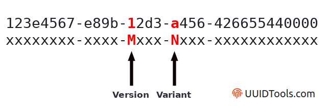

# Short Guid

[PM> NuGet\Install-Package md.shortguid](https://www.nuget.org/packages/md.shortguid/)  

A V4 GUID represented in the form of a short(er), base64-encoded, url-safe, string.  
With the *option* to replace version, and variant data for custom flags.  

  

By default .net's `Guid.NewGuid()`, creates a **Version "4"**, and **Variant "DCE 1.1, ISO/IEC 11578:1996"** UUID.  
`ShortGuid` can replace these constant values with custom ones, allowing users to set flags in these locations.  

A standard `Guid` has 36 characters: `2249d2d9-e29a-4c7c-9505-256760d13fad`.  
A `ShortGuid` has 22 characters: `2dJJIprifEyVBSVnYNE_rQ`.  

`Guids`, and `ShortGuids` can be converted to one another without any data loss.  
`ShortGuids` are url safe.  

### Short Guid

```cs
// TODO: ...
```

### Short Guid With Flags

```cs
// TODO: ...
```

### Converting between Guids and Short Guids

```cs
// TODO: ...
```

# Credits
* [Icon](https://www.flaticon.com/free-icon/bird_2630452) made by [Vitaly Gorbachev](https://www.flaticon.com/authors/vitaly-gorbachev) from [Flaticon](https://www.flaticon.com/)
* [Guid Diagram Example](https://www.uuidtools.com/decode) from uuidtools.

# Changelog

## 1.0.0

* `ShortGuid` type, with the options of using a plain V4 GUID, or one with custom flags.  
